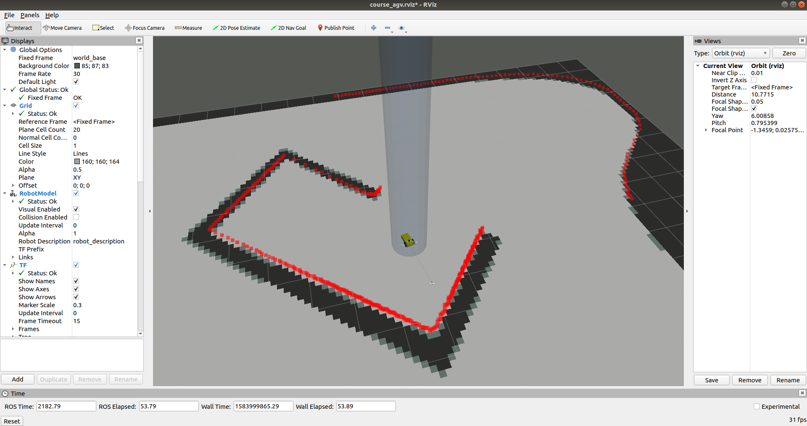

# course_agv source

> 进度:
> 
> * [x] planning
> * [ ] icp
> * [ ] ekf

* 安装python-catkin-tools
  * catkin build进行编译
  * catkin clean进行清理
* 运行gazebo
  * `roslaunch course_agv_gazebo course_agv_world.launch`
  * sensors包含了imu以及2d laser

* 查看效果
  * 在gazebo开启的情况下运行`roslaunch course_agv_gazebo course_agv_world_rviz.launch`

